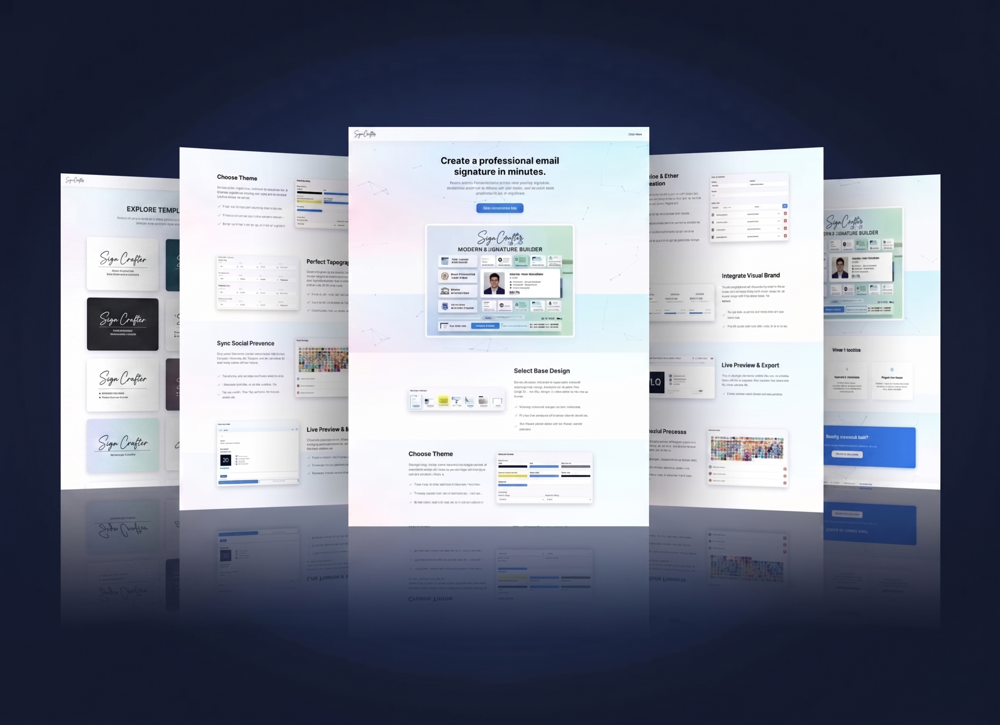
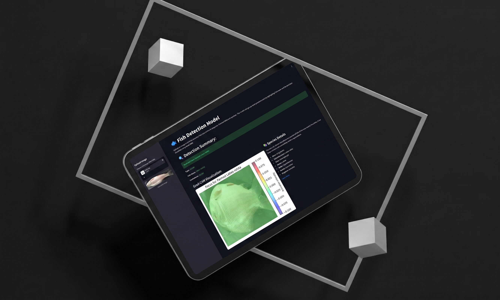

# 🚀 Sayham Kayes – Developer Portfolio

<p align="center">
  
</p>

<h3 align="center">
Modern, Animated & Responsive Portfolio Website
</h3>

<p align="center">
Showcasing my skills, projects, experience, testimonials, and contact information.
</p>

<p align="center">
  
  
  
  
  
</p>

---

## 🌐 Live Demo

> **Portfolio:** https://your-portfolio-url.vercel.app

---

# ✨ Features

- 🎨 Modern & Clean UI
- ⚡ Smooth Animations
- 📱 Fully Responsive Design
- 🌙 Dark Theme
- 👨‍💻 About Me Section
- 💼 Experience Timeline
- 🛠 Skills Showcase
- 🚀 Featured Projects
- 💬 Testimonials
- 📧 Contact Form (EmailJS)
- ✨ Interactive UI Components
- ⚙ Fast Performance with Vite

---

# 🖥 Tech Stack

### Frontend

- React
- TypeScript
- Vite
- Tailwind CSS

### UI & Animation

- Framer Motion
- GSAP
- Radix UI
- Lucide React

### Form Handling

- React Hook Form
- Zod Validation
- EmailJS

---

# 📂 Project Structure

```
src
│
├── assets
├── components
├── hooks
├── lib
├── routes
├── styles
└── utils
```

---

# 📸 Preview

## Home


---

## Projects



---

## Experience



---

## Testimonials


---

## Contact


---

# ⚙ Installation

Clone the repository

```bash
git clone https://github.com/yourusername/your-repository.git
```

Go to project directory

```bash
cd your-repository
```

Install dependencies

```bash
npm install
```

Run development server

```bash
npm run dev
```

Build for production

```bash
npm run build
```

Preview production build

```bash
npm run preview
```

---

# 📦 Available Scripts

| Command | Description |
|----------|-------------|
| `npm run dev` | Starts development server |
| `npm run build` | Creates production build |
| `npm run preview` | Preview production build |
| `npm run lint` | Run ESLint |
| `npm run format` | Format code with Prettier |

---

# 📬 Contact

**Sayham Kayes**

- 🌐 Portfolio: https://your-portfolio-url.vercel.app
- 📧 Email: your-email@example.com
- 💼 LinkedIn: https://linkedin.com/in/your-profile
- 🐙 GitHub: https://github.com/SayhamKayes

---

# ⭐ Support

If you like this project, consider giving it a ⭐ on GitHub.

It motivates me to build more awesome projects.

---

<p align="center">
Made with ❤️ by <b>Sayham Kayes</b>
</p>